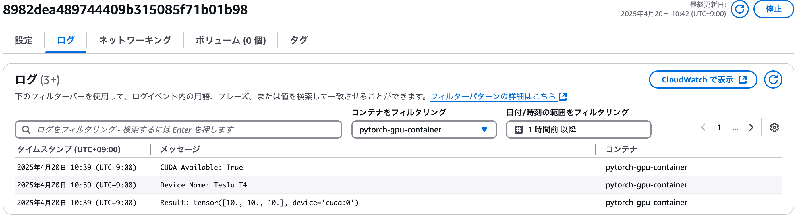

# ECS on GPU EC2：ECSクラスターで動かすCUDAコンテナ基盤自動構築

<p align="center">
  
</p>


[](https://www.python.org/)

[](https://docs.docker.com/compose/)


このリポジトリは、Terraformを使用してAWS上にGPU搭載EC2インスタンスで動作するECSクラスタを自動構築するためのものです。NVIDIAドライバーがプリインストールされたAMIを使用し、CUDAコンテナの実行基盤を容易に構築できます。

## 概要
深層学習やGPGPU計算などのGPUを必要とするワークロードを、ECS(Elastic Container Service)を用いてコンテナ化し、容易にスケーリング、管理することを目的としています。Terraformによるインフラのコード化により、再現性と変更容易性を高めています。

## 特徴
+ CUDA対応GPUインスタンス(g4dn.xlarge)をECSクラスタで利用可能
+ NVIDIAドライバープリインストールAMIの使用で、セットアップの手間を削減
+ Terraformによるインフラのコード化で、容易な構築、変更、破棄が可能
+ 将来的な拡張性を考慮した設計

## 基本インフラの構築

以下のコードを実行してインフラを構築します。
```
bin/terraform_apply
```

### 停止
以下のコードを実行すると停止できます。
```
bin/terraform_destroy
```
